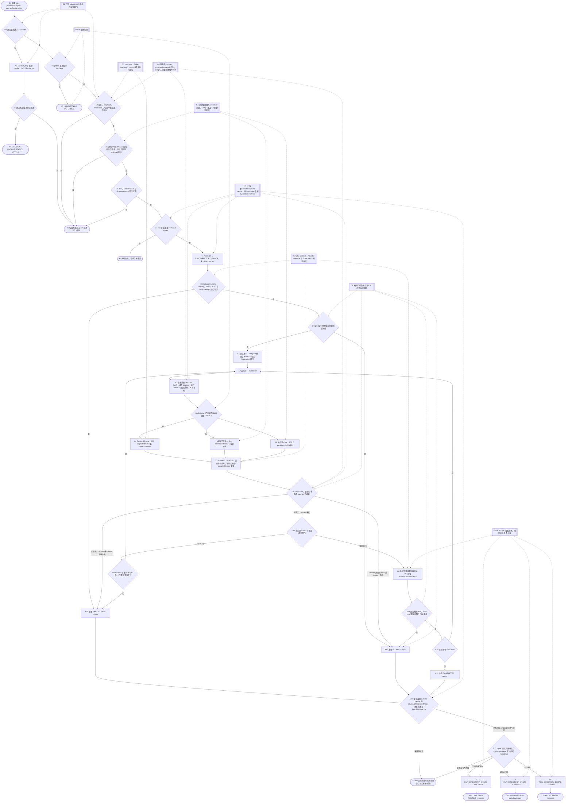

# Layered RAG performance baseline

## Purpose

定义已实现的仓库内分层性能工作流。默认入口只做静态校验，输出
`NOT_RUN / FIXTURE_STATIC / httpRequestsSent=0`；只有显式 `--execute` 与全部
fail-closed 门禁同时通过时，才使用 Apache JMeter 5.6.3 对 loopback Backend
执行 L1 Retrieval、L2 异步摄取和 L3 Chat 的 warm-up 与稳定窗口。

当前实现不启动或修复应用、数据库、Milvus、JMeter 依赖或 Provider，不执行 L4，
不支持 provider-budgeted 运行，也不把本机 RUNTIME 证据外推为生产容量、质量、成本或 SLA。

## Entry, preconditions, and outcomes

- Entry：仓库根目录运行 `backend/evals/performance/run-performance.ps1`，它只把参数转交给
  `run_performance.py:main`；未指定 `-Execute` / `--execute` 时默认 validate-only。
- Validate-only：校验 profile、JMX 和报告 schema，不运行 HTTP/JMeter，不创建 run 目录，
  返回 `NOT_RUN` 与 `FIXTURE_STATIC`。
- Execute gates：需要 CLI `--execute`、`execution.enabled=true`、
  `execution.disposableStateConfirmed=true`、Backend 与独立 Actuator origin 均为 loopback、
  `L4=false`、合法运行时环境值与匹配的 workload fixture 指纹、JMeter 精确版本 5.6.3、
  匹配的 Actuator runtime build identity，以及可读取且在每个 warm-up/稳定窗口前后不变的
  零外部调用 counter。
- Runtime freeze：入口立即复制环境；profile、JMX、Schema 快照与 JMeter launcher 文件在每次
  invocation 前后及最终报告前复核 SHA-256。launcher hash 不代表整个 JMeter 安装或依赖 jar。
- 当前成本边界：`provider-budgeted` 因 usage/cost 仍未测量且数值字段为 null 而被拒；
  `external.mode=disabled` 与 budget 0 本身也不足以执行，必须配置
  `zeroExternalCallMetricPath`。示例 profile 保持 `NOT_READY`。
- L1：`POST /internal/performance/retrieval`，要求 HTTP 200、`degraded == false` 且
  `status == success`，因此空结果也不能进入性能样本。
- L2：从 run-scoped 唯一 disposable document ID pool 原子取号，只提交一次
  `POST /api/documents/{id}/ingest`（202、`reused=false`），再轮询 job 至
  `SUCCEEDED / FAILED / CANCELLED` 或 deadline；poll 不是提交重试。
- L3：`POST /api/agent/chat`，`sessionId` 必须缺失或为 null，使每次请求创建新会话；
  响应必须为 HTTP 200 且 Evidence Decision 精确等于 `ANSWER`。
- Load：每个启用层先以最低并发 warm-up 60 秒且不计入结果，再按 `1 / 2 / 4 / 8`
  各运行 180 秒稳定窗口。每档从 privacy-safe JTL 计算 nearest-rank P50/P95/P99、
  throughput、error rate、HTTP 429 和 5xx。
- Resource/stop：独立 loopback Actuator 只提供 health、CPU、heap 与零外呼 counter。
  memory 大于 0.80 立即停止；CPU 必须连续采样高于 0.85 达 120 秒，期间任一样本
  小于等于阈值都会重置；任一 429、error rate 大于 0.01，或 P99 连续两个分析窗口
  大于最低并发 P99 的 2 倍也会停止。
- Artifacts：执行前先记录 Git HEAD/dirty fingerprint、profile/JMX/Schema hash、环境摘要、
  JMeter 版本与 launcher hash，再 exclusive-create run 目录。目录创建时没有 initial manifest；只在最终阶段以
  exclusive-create 写入 `performance-report.json`。
- Terminal report：成功完成所有 invocation 为 `COMPLETED`，阈值触发为 `STOPPED`，
  捕获到 `RuntimeEvidenceError` 为 `FAILED`。`finish_report()` 还会复核最终 runtime identity、
  Git 与 source/artifact/JMeter 指纹：identity 不匹配写成 `FAILED / INVALID / RUNTIME_IDENTITY`，
  source/artifact 漂移写成 `FAILED / INVALID / SOURCE_DRIFT`（若两者同时发生，后者覆盖 stop reason）。
  只有强制终止、未捕获异常、报告交叉约束失败或最终报告独占写入失败，才可能留下“目录存在但
  无报告”的不完整目录；实现不会自动覆盖或续跑。

## Runtime flow



## Component sequence

```mermaid
sequenceDiagram
    actor User
    participant PS as run-performance.ps1
    participant Py as run_performance.py / performance_workflow.py
    participant FS as Exclusive artifact directory
    participant Actuator as Loopback Actuator
    participant JMeter
    participant Backend as Loopback Backend
    participant Probe as RetrievalPerformanceProbeController
    participant Worker as Async ingestion worker
    participant Chat as RagChatController
    participant Trace as TraceContextService / TracePerformanceMetrics
    participant JTL as Privacy-safe JTL

    User->>PS: invoke; -Execute optional
    PS->>Py: forward profile, JMX, output and mode
    alt validate-only default
        Py->>Py: validate_profile + validate_jmx + schema metadata
        Py-->>User: NOT_RUN / FIXTURE_STATIC / httpRequestsSent=0
    else explicit execute
        Py->>Py: validate execution, runtime env, JMeter 5.6.3 and provenance
        alt any pre-run gate fails
            Py-->>User: non-zero rejection; no run directory
        else all pre-run gates pass
            Py->>FS: mkdir(exist_ok=false)
            FS-->>Py: T1 directory exists; no manifest/status file
            Py->>Actuator: runtime build identity + health + CPU + heap preflight
            loop each enabled layer
                Py->>Actuator: read zero-external-call counter before warm-up
                Py->>JMeter: lowest-concurrency warm-up; environment-only payloads
                JMeter->>Backend: selected L1, L2 or L3 request
                alt L1
                    Backend->>Probe: POST /internal/performance/retrieval
                    Probe-->>JMeter: sanitized 200 and degraded=false, or failed sample
                else L2
                    JMeter->>JMeter: atomically consume one unique disposable document ID
                    JMeter->>Backend: POST /api/documents/{id}/ingest
                    Backend-->>JMeter: 202, jobId, reused=false
                    Backend->>Worker: asynchronous job ownership
                    loop bounded status observation
                        JMeter->>Backend: GET /api/ingestion/jobs/{jobId}
                        Backend-->>JMeter: state
                    end
                    JMeter->>JMeter: succeed only at SUCCEEDED; no resubmit
                else L3
                    JMeter->>Chat: POST /api/agent/chat without fixed sessionId
                    Chat-->>JMeter: 200 and evidence decision ANSWER, or failed sample
                end
                Backend->>Trace: close spans with monotonic duration
                Trace->>Trace: record operation/result metric; failure cannot affect business
                JMeter-->>JTL: labels/timing/status only; no bodies, headers, URLs or assertion messages
                Actuator-->>Py: sampled CPU/heap
                Py->>Actuator: read zero-external-call counter after warm-up
                loop stable concurrency 1, 2, 4, 8
                    Py->>Actuator: counter before
                    Py->>JMeter: fingerprinted steady window
                    JMeter-->>JTL: privacy-safe samples
                    Actuator-->>Py: CPU/heap samples
                    Py->>Actuator: counter after
                    Py->>JTL: verify sustained thread evidence; aggregate result and samplerMetrics
                    Py->>Py: evaluate 429/error/P99 and CPU/memory stops
                end
            end
            alt all invocations complete
                Py->>Py: prepare COMPLETED report
            else threshold stop
                Py->>Py: prepare STOPPED report
            else caught runtime evidence failure
                Py->>Py: prepare FAILED / INVALID / RUNTIME_EVIDENCE report
            end
            Py->>Actuator: recheck runtime build identity
            opt identity unavailable or changed
                Py->>Py: overwrite terminal tuple with FAILED / INVALID / RUNTIME_IDENTITY
            end
            Py->>Py: recheck Git, source snapshots, artifacts and JMeter launcher
            opt source or artifact drift
                Py->>Py: overwrite terminal tuple with FAILED / INVALID / SOURCE_DRIFT
            end
            alt report cross-fields validate and mode x succeeds
                Py->>FS: exclusive-create performance-report.json
                FS-->>User: final report path
            else validation, unhandled finalization or exclusive write fails
                FS-->>User: incomplete directory without authoritative report
            end
        end
    end
```

## Persisted artifact lifecycle

`NOT_RUN` 是 stdout 静态校验结果，不创建 run entity。真实执行先只创建目录；没有 initial
manifest，也没有可恢复的 `RESERVED` 状态文件。只有 `performance-report.json`
exclusive-create 成功后，`COMPLETED / STOPPED / FAILED` 才是权威终态。

```mermaid
stateDiagram-v2
    [*] --> ABSENT
    ABSENT --> RUN_DIRECTORY_EXISTS: T1 execute [pre-run gates pass] / mkdir exist_ok=false; no manifest
    RUN_DIRECTORY_EXISTS --> COMPLETED: T2 all_invocations_complete / exclusive-create report with COMPLETED
    RUN_DIRECTORY_EXISTS --> STOPPED: T3 threshold_triggered / exclusive-create report with STOPPED
    RUN_DIRECTORY_EXISTS --> FAILED: T4 runtime_evidence_failure_or_final_drift / exclusive-create report with FAILED and INVALID evidence
```



最终 runtime identity 失败与 source/artifact/Git/JMeter 漂移不是“无报告”分支：实现会将终态
改写为 `FAILED / INVALID` 并尝试 T4，其中 source/artifact 漂移使用 `SOURCE_DRIFT` stop reason。
只有进程被强制终止、出现未捕获异常、报告交叉约束失败或最终报告独占写入失败，目录才可能停留在
`RUN_DIRECTORY_EXISTS` 且没有报告。实现不会自动重试、补偿、恢复或覆盖该目录；操作者只能保留它
用于诊断并使用新的 run ID。

## Safeguards

- G1：PowerShell/Python 默认 validate-only；`--execute` 与 profile
  `execution.enabled=true` 缺一不可。
- G2：profile、execution gate 和 JMX dispatch 三层都拒绝 L4。
- G3：Backend/Actuator 必须为 loopback；L1 Controller 默认不注册，显式启用后仍校验
  Servlet 实际来源和 token，token 使用 `MessageDigest.isEqual`。
- G4：token、payload、query 与业务 ID 只从入口冻结的环境副本读取且不进入 profile、命令、JTL 或报告；
  环境 payload/ID pool 与声明规模必须匹配 workload fixture 指纹；L2 使用分区后互斥的唯一
  disposable ID，L3 拒绝非 null `sessionId`。
- G5：只允许 budget 0 且 counter 在每个 invocation 前后可读并不变的运行；
  provider-budgeted 被拒，Provider usage 始终标记为未测量且数值字段保持 null，而非 0。
- G6：Git dirty 内容、profile/JMX/Schema 快照、冻结环境、JMeter 版本、launcher hash 与
  Actuator runtime build identity 参与 provenance；identity 在执行前后复核，快照和 launcher
  在 invocation 前后及最终写入前复核，run 目录和最终报告均 exclusive-create。launcher hash
  不代表整个 JMeter 安装。
- G7：`samplerMetrics` 仅由 JTL sampler label 聚合；Actuator 只提供 health/CPU/heap/零外呼
  counter；`TracePerformanceMetrics` 是 Backend 内部 operation/result 指标，不被 runner
  抓取或冒充报告 samplerMetrics。
- G8：memory 超阈立即停止；CPU 只在连续超阈覆盖达到配置秒数后停止并在回落时重置；
  429、error rate 和连续窗口 P99 使用预声明阈值，不自动调参或重跑。
- G9：报告是 loopback `RUNTIME` 证据；warm-up 不进入结果，状态三元组、stopReason、结果线程与
  resource 证据必须满足交叉约束；`STOPPED / FAILED` 不能当作完整基线，任何结果都不证明
  PRODUCTION、质量、成本或 SLA。

## Failure, retry, and observability

本流程没有提交重试、自动补偿或自动清理。L2 poll 只观察已提交 job；`FAILED / CANCELLED /
deadline` 会成为失败样本，`reused=true`、ID pool 耗尽或 L2 窗口覆盖不足会使 runtime
evidence 为 `FAILED`。JMeter/Actuator/外呼 counter 缺失或不可用同样不能被填零或忽略。

`RuntimeEvidenceError` 在目录创建后会被转换为 `FAILED` report；最终 runtime identity 失败会写成
`FAILED / INVALID / RUNTIME_IDENTITY`，最终 source/artifact/Git/JMeter 漂移会写成
`FAILED / INVALID / SOURCE_DRIFT`。pre-run gate（包括 L4）失败不创建目录。
JMeter engine log 在每次 invocation 的 finally 中删除。Trace START/EVENT/LINK duration 为 0，
END 使用单调时钟差并夹到非负；event sink、clock 或 metrics 故障不得改变业务结果或 scope 清理。
这些 Backend metrics 与 JTL/Actuator 报告来源保持分离。

## Implementation reconciliation

契约已按 `backend/evals/performance/**`、L1 Probe、Trace duration/metrics 和现有测试逐项对账。
机器可读路径、符号与测试映射见 `traceability.yaml`。
