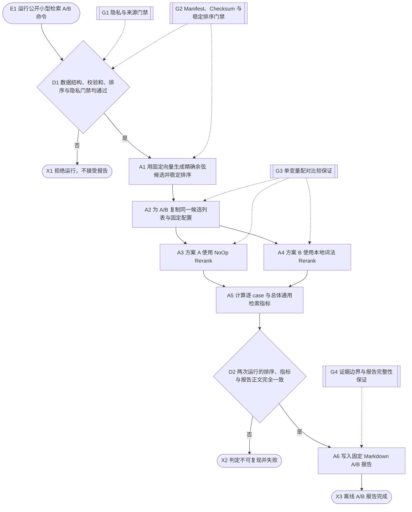
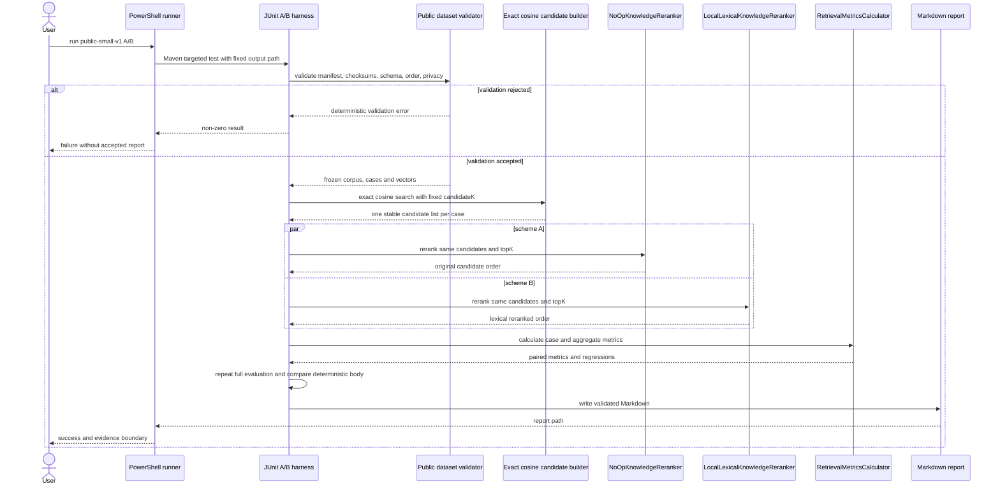

# Public small offline retrieval evaluation

## Purpose

在不读取私有语料、不使用密钥、网络、真实 Embedding 或 LLM 的前提下，校验版本化公开小型数据集，并在完全相同的精确余弦候选上比较无 Rerank 与当前本地词法 Rerank，生成可重复的逐 case Markdown 报告。

本流程是离线组件评测，只证明固定合成样例上的指标实现、Rerank 接线和回归稳定性；不代表真实课程检索质量、线上索引、生成质量或生产验收。

## Entry, preconditions, and terminal outcomes

- Entry: 从仓库根目录运行无密钥 PowerShell A/B 命令。
- Preconditions: 数据文件、manifest 和 checksum 一致；ID 与行顺序稳定；字段引用闭合；公开内容通过隐私门禁。
- Success outcome: 两个方案在同一候选集上完成，重复运行逐字节一致，并生成包含配置、逐 case、总体指标和退化样例的 Markdown 报告。
- Rejection outcome: 数据缺失、哈希漂移、结构错误、排序不稳定或隐私命中时，命令非零退出且不接受报告。
- Failure outcome: 两方案输入配置不同、指标计算失败或重复运行漂移时，命令非零退出并保留可诊断测试错误。

## Runtime flow

## Component sequence

## State lifecycle

本流程不修改业务持久化状态。唯一输出是可重新生成的 Markdown 报告，因此不建立业务状态机。

## Safeguards

- G1：只接受声明为中性原创虚构技术文本的数据；公开数据文件自动拒绝用户绝对路径、邮箱、手机号、疑似凭据和私有知识库标识。
- G2：核心文件 SHA-256、数量、ID 唯一性、引用闭合、固定 seed 和稳定排序全部一致后才运行。
- G3：A/B 共用同一 corpus、cases、向量、精确余弦候选、candidateK、topK 和 seed，唯一变量是 Reranker 实现。
- G4：报告必须列出配置、逐 case 排名与指标、总体指标、改善/退化样例，并明确 fixture 结果不代表真实或生产效果。

## Failure, recovery, and observability

流程没有网络调用、重试和补偿。任何校验、指标或确定性断言失败都由 Maven 返回非零退出码；修正稳定输入或评测逻辑后重跑即可。报告是派生工件，不是 source of truth；数据集、manifest、checksum、评测器版本和复现命令共同构成归因依据。

## Implementation notes

机器可读的代码与测试映射维护在 `traceability.yaml`。
