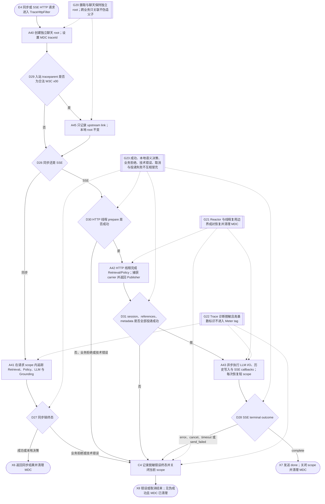
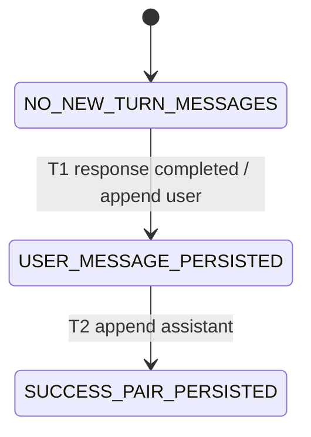

# RAG 课程问答

## Purpose

说明当前根源码中的同步与 SSE 课程问答如何读取有限历史、只检索 ACTIVE 文档版本、
通过统一 CandidateSource 边界执行 Dense/Lexical 召回、RRF 与可配置 Rerank，并在生成前
执行 `ANSWER / CLARIFY / REFUSE` Evidence Sufficiency 决策。只有 `ANSWER` 会构造请求级
`CitationCatalog`、渲染 Prompt 并调用 OpenAI-compatible 模型；生成后 Grounding 开启时，
完整候选还要经过 Citation Integrity、Claim-Evidence Support 和最多一次修复。
`CLARIFY / REFUSE` 使用固定本地响应。三种成功结果都会返回脱敏决策、检索与 Grounding
metadata，并保存本轮用户与助手消息。

本契约同时冻结两个持久化限制：模型或准备阶段失败时不会追加本轮成功消息，但首次请求可能
已经创建空会话；两次消息追加各自提交，不保证消息对跨调用原子落库。Step 2.2 已把现有线上
Dense 路径等价迁移到 CandidateSource，
并提供独立 MySQL LexicalCandidateSource 与双源 Collector。Step 2.3 已接入默认自动启用的
Hybrid 双源收集与 RRF，并保留显式 `rag.hybrid.enabled=false` 的 Dense-only 紧急回退：双路都有非空、正权重结果
时才按每路内部稳定去重、跨路贡献求和的规则融合；只有一路成功或只有一路非空时保留该路
原始顺序和原始分数并跳过 RRF；两路异常才使检索失败。无论 Dense-only 还是 Hybrid，
最终先受全局 CandidateK 约束，再进入 Step 3.1 的可观察 Rerank，并由最外层应用 FinalK。真实 MySQL、
Milvus、Embedding、LLM、进程重启和生产流量需要按
`docs/acceptance/RAG_PRODUCTION_E2E_CHECKLIST.md` 独立验收。

## Step 2.3 implemented behavior

- 配置边界：`rag.hybrid.enabled=true` 为默认值，无需人工开启；只有显式设为 `false` 才回退 Dense-only。
- 参数边界：RRF `k` 必须大于 0；Dense/Lexical 权重必须是有限非负数且至少一路为正。
- 融合不变量：每路先稳定去重再重新计算从 1 开始的 rank；跨 source 命中分别贡献
  `weight/(k+rank)` 后求和；输出只保留一份 chunk 元数据；同分按 chunkId 升序。
- 零权重语义：双路均非空时，零权重 source 不引入候选也不强制另一条 source 改写为 RRF 分；
  只有一条非空或成功时仍按 fail-open 契约保留该条原始结果。
- 回退语义：单路成功、另一条异常，或双路成功但只有一路非空时，不做 RRF，保留成功路
  的稳定顺序和 raw score；两路空是合法空结果，不标记 degraded。
- 可观察性：一路异常时记录 source、failureType、latency 和 candidateCount，但不记录 query、
  Chunk 正文、凭据或完整外部错误；两路异常向现有失败出口传播。
- 验收边界：确定性单测与后端回归可以证明实现契约；Dev45 参数 sweep、Test55 M2、真实
  MySQL/Milvus/Provider 与生产 E2E 只有实际运行后才能标记通过。

## Step 3.1 implemented behavior

- 候选边界：Dense SourceK 与 Lexical SourceK 独立配置；RRF 或单源回退后统一截断到
  CandidateK，Rerank 只能重排这个冻结集合，最后再截断到 FinalK。
- 分数边界：`denseScore`、`lexicalScore`、`fusionScore`、`rerankScore` 与 `finalScore`
  分开保留；缺失分数不是 0，后阶段不得覆盖前阶段证据。
- 正常模式：requested provider 支持 `none`、`local`、`remote`；actual provider 只能由
  实际成功路径得出，不能照抄 requested。
- 有界恢复：fail-open 时 remote 技术失败降级 local，local 技术失败再恢复 Rerank 输入的
  精确原序；fail-closed 时技术失败向现有问答失败出口传播。恢复链不重新检索、不扩张候选集。
- threshold：只在 remote/local 成功后按 actual provider 使用各自阈值；成功排序后全部低于
  阈值属于可观察的语义空，不自动降阈值，也不触发技术 fallback；original 不应用阈值。
- composite：保留可配置、可版本化的 normalized composite 调试入口，但生产默认关闭；权重
  只能在 Dev45 上校准，未通过预声明 Gate 前不得把它描述为优于单独 rerank score。
- 可观察性：内部始终保留 requested、actual、attempt、fallbackReason、threshold 与
  semantic-empty；日志不记录 query、Chunk 正文、凭据或完整外部错误。

## Step 3.2 implemented behavior

- 诊断传播：问答主链路调用 `retrieveWithResult`；`RetrievalExecutionResult` 同时携带 FinalK
  chunks 与脱敏 `RetrievalDiagnostics`。旧 `retrieve` 接口仍然兼容题目生成、练习与评测调用方。
- 三分类规则：默认启用 `rag.evidence-decision.enabled=true`。Policy 依次考虑合法空结果、问题
  歧义、可追踪来源、与真实 score provenance 对应且显式开启的阈值、证据冲突和直接词法覆盖，
  产出 decision、reasonCode、usableEvidenceIds、observedSignals 与 policyVersion。
- 生成门控：只有 `ANSWER` 使用 `usableEvidenceIds` 过滤 FinalK 后渲染 Prompt 并调用 LLM；
  `ANSWER` 必须至少包含一个且全部 ID 都能唯一映射到本次检索证据；未知、空或重复 chunkId
  都作为内部契约失败传播；
  `CLARIFY / REFUSE` 都清空对外 references，并由 `EvidenceDecisionRenderer` 生成固定本地文本。
- 同步/SSE 一致性：同步 JSON 和 SSE 都返回 `RagChatMetadata`。SSE 顺序为 session、references、
  metadata、一个或多个 delta、done；本地决策使用单元素 Flux，不调用 ChatClient。
- 历史语义：同步成功后立即保存本轮 user/assistant；SSE 只有响应 Flux 正常 complete 后保存。
  该规则同时适用于模型答案与本地 CLARIFY/REFUSE。
- 错误边界：检索、Rerank 或 Policy 技术异常直接传播到既有同步/SSE 错误出口，不会被伪装成
  语义 REFUSE，也不会追加本轮成功消息。
- 配置边界：Evidence Decision 的各 score threshold 按 remote-rerank、local-rerank、fusion、
  dense、lexical、legacy-final 分开配置且默认关闭；不同来源的数值不可互换。任何门槛一旦开启，
  必须同时提供可审计的 `calibration-id`，否则 fail-closed。
- 阶段边界：本 Step 只实现生成前 Evidence Sufficiency；生成后的 Citation Integrity 与
  Claim-Evidence Support 由下面的 Step 3.2A 独立执行，不能用 `ANSWER` 代替。

## Step 3.2A implemented behavior

- 唯一来源目录：`ANSWER` 分支从本次 `usableChunks` 只构造一次请求级 `CitationCatalog`，
  Prompt、Citation Integrity、Claim Support 与一次修复都复用该目录；`S1...Sn` 不跨请求稳定，
  也不暴露内部 `chunkId/documentId`。
- 两层校验：Citation Integrity 只检查引用语法、白名单归属和原子事实主张覆盖；
  Claim-Evidence Support 另行判断每条主张为 `SUPPORTED / UNSUPPORTED / CONTRADICTED / UNCERTAIN`。
- 放行条件：只有引用完整且全部事实主张均为 `SUPPORTED` 才返回模型候选。确定性数字、日期、
  标识和显式否定规则先执行；未经过人工集校准的语义 Judge 只能返回 `UNCERTAIN`。
- 有界修复：首次校验失败后，使用同一 Prompt、同一 CitationCatalog 和结构化失败原因生成一份
  完整替代回答；修复最多一次，并重新执行两层完整校验。再次失败时丢弃模型候选并返回安全说明。
- 流式安全：严格 Grounding 开启时，SSE 必须先缓冲完整候选并完成校验，再发送最终 metadata
  和一个已验证 delta；未验证 token 不得提前泄露。功能默认关闭，直到独立人工 Dev 集完成校准。
- 可观察性：同步与 SSE metadata 记录 `DISABLED / ACCEPTED / REPAIRED / REJECTED`、生成次数、
  引用覆盖率、四态计数、validator 版本与 Judge calibration ID，但不复制问题、Prompt 或证据正文。

## Step 4.1 implemented behavior

- 实验开关：MMR 默认关闭；关闭时继续让 Rerank 直接裁剪到 FinalK，结果顺序与当前实现一致。
- 候选边界：开启时仍只处理冻结的 CandidateK 子集，但让 Rerank 返回阈值过滤后的完整候选池，
  再由 MMR 选取 FinalK；MMR 不能补回 CandidateK 之外的 Chunk。
- 相关性与冗余：相关性使用上游 Rerank 后稳定顺序归一化，冗余使用本地、确定性的 Jaccard
  文本相似度；默认实验值 `lambda=0.7` 只是可回退候选，不构成 Dev45 最优参数结论。
- 可观察性：诊断只记录开关、策略版本、lambda、输入/输出计数、选择前后平均冗余、唯一来源数与
  耗时；不记录 query、Chunk 正文或相似度矩阵。
- 验收边界：本变更只建立默认关闭的实验候选和确定性契约。Dataset Gate、正式 Hybrid Dev45、
  lambda sweep、Test55、真实延迟/质量收益与生产开启都必须保持独立证据状态。

## Step 4.3 implemented behavior

- 独立 Trace：每个同步或 SSE HTTP 请求都创建新的本地聊天 root；合法入站 `traceparent` 只形成
  span link，不成为 parent。通用 HTTP Filter 不信任也不回显外部 `X-Correlation-Id`；未来若需
  跨业务关联，必须由已认证业务层显式设置 `correlationId`，不能把聊天伪造成摄取子 span。
- MDC 与异步边界：MDC key 固定为 `traceId`，同时维护 `spanId` 与可选 `correlationId`。同步链在
  请求 scope 内传播；SSE 在返回前捕获不可变 `TraceCarrier`，subscribe 与每个 callback 在实际线程
  恢复短 scope 并立即清理。HTTP root 对 SSE 只记录 `dispatched`，不冒充异步流已经成功。
- 真实执行顺序：`RagChatService.stream` 在 HTTP 线程先完成 session/history、Retrieval/Fusion/
  Rerank 与 Evidence Policy。严格 Grounding 开启时，完整模型生成、Citation Integrity、Claim
  Support 与一次修复也在返回前完成；默认关闭时只创建 lazy LLM Flux。订阅线程只执行剩余 LLM
  I/O、delta/error/complete、成功历史写入和 SSE terminal，不重复 Retrieval/Policy。
- 阶段可观察性：Retrieval/Fusion/Rerank、Evidence Policy、LLM、Citation Integrity/Claim Support
  和一次 Grounding 修复使用真实子 span。CLARIFY/REFUSE 不创建 LLM span。
- 错误与取消：唯一 SSE terminal 区分 `completed`、`error`、`cancelled`、`timeout` 与
  `send_failed`。prepare 的业务拒绝或技术失败也会在 HTTP request Trace 上记录唯一脱敏 terminal。
  初始 session/references/metadata 投递失败时，Controller 尚未订阅返回的 `response.stream()`；
  默认 Grounding 关闭时 lazy Provider 尚未启动，严格 Grounding 开启时 Provider 已在 prepare 内
  完成，因此该分支只保证不订阅返回 Publisher、没有活跃上游需要取消。delta 投递失败、客户端
  取消、Emitter error 或 timeout 会 dispose 活跃订阅，取消继续传到 provider
  `CompletableFuture.cancel(true)`，已收到 headers 时关闭响应 `Stream`；done/error 投递失败发生在
  上游终止后，只记录 `send_failed`，不伪造一次额外 Provider 取消。
- 隐私与基数：可投递的 SSE 错误事件只使用 `CHAT_STREAM_FAILED` 与通用消息；Trace 只记录异常类型。
  日志、span、event 不记录 question、历史、Prompt、Chunk/引用正文、模型 token、API Key、完整
  远端响应、carrier 原值或 baggage；高基数 ID 不得成为 Meter tag。

### Implemented trace flow



### Implemented trace sequence

```mermaid
sequenceDiagram
    actor User
    participant Filter as TraceHttpFilter
    participant Trace as TraceContextService
    participant API as RagChatController
    participant Chat as RagChatService
    participant Retrieval as Retrieval/Rerank
    participant Policy as EvidenceDecisionPolicy
    participant LLM as OpenAiCompatibleChatClient
    participant Grounding as GroundedAnswerGenerator
    participant Reactor as SSE Publisher/Subscriber

    User->>Filter: POST chat or chat/stream
    Filter->>Trace: open independent local root and MDC traceId
    opt valid upstream traceparent exists
        Trace->>Trace: record link only; never adopt it as parent
    end
    Filter->>API: invoke endpoint
    alt synchronous chat
        API->>Chat: chat(...)
        Chat->>Retrieval: retrieve and rerank
        Chat->>Policy: decide
        alt ANSWER
            Chat->>LLM: one call or bounded Grounding generation
            opt strict Grounding enabled
                Chat->>Grounding: citation, claim support, at most one repair
            end
        else CLARIFY or REFUSE
            Chat->>Chat: deterministic local response; no LLM span
        end
        alt success
            Chat-->>API: response and truthful terminal result
        else technical error
            Chat--xAPI: sanitized error result
        end
        API-->>User: JSON or error
        Filter->>Trace: close request scope and clear MDC
    else SSE chat
        API->>Chat: stream(...)
        Chat->>Retrieval: retrieve and rerank on HTTP thread
        Chat->>Policy: decide on HTTP thread
        alt ANSWER and strict Grounding enabled
            Chat->>LLM: buffer complete generation on HTTP thread
            Chat->>Grounding: validate and optionally repair before return
        else ANSWER and strict Grounding disabled
            Chat->>LLM: create lazy provider Flux and capture LLM carrier
        else CLARIFY or REFUSE
            Chat->>Chat: create deterministic single-item Flux; no LLM span
        end
        alt prepare rejects or throws before Publisher is returned
            Chat--xAPI: BizException or technical exception
            API-->>User: attempt CHAT_STREAM_FAILED; delivery may fail
            API->>Trace: request child terminal=error or send_failed exactly once
            API-->>Filter: return completed SseEmitter
            Filter->>Trace: close HTTP root as dispatched and clear MDC
        else prepared response and Publisher
            Chat->>Trace: capture history completion carrier
            Chat-->>API: prepared response and Publisher
            alt session, references, or metadata delivery fails
                API->>Trace: terminal=send_failed; returned Publisher was not subscribed
                Note over Chat,API: lazy Provider not started; strict-Grounding Provider already completed during prepare
                API-->>Filter: return completed SseEmitter
                Filter->>Trace: close HTTP root as dispatched and clear MDC
            else initial events delivered
                API-->>User: session, references, metadata
                API->>Reactor: schedule subscribe with captured carrier
                API-->>Filter: return SseEmitter
                Filter->>Trace: close HTTP root as dispatched and clear MDC
                Reactor->>Trace: restore chat.sse.subscribe scope
                opt lazy ANSWER Flux
                    Reactor->>LLM: sendAsync and consume provider stream
                end
                loop each delta or callback
                    Reactor->>Trace: restore short signal scope
                    Reactor-->>User: delta or sanitized error event
                    Reactor->>Trace: close signal scope and clear MDC
                end
                alt complete
                    Reactor->>Chat: persist successful user and assistant messages
                    Reactor-->>User: done
                    Reactor->>Trace: terminal=completed, or send_failed if done delivery fails
                else upstream error
                    Reactor-->>User: attempt CHAT_STREAM_FAILED
                    Reactor->>Trace: terminal=error, or send_failed if error delivery fails; upstream is already terminal
                else client cancel, active delivery failure, emitter error, or timeout
                    Reactor->>LLM: dispose subscription; cancel Future or close response Stream when active
                    Reactor->>Trace: terminal=cancelled, send_failed, or timeout
                end
                Reactor->>Trace: final cleanup on termination
            end
        end
    end
```

## Entry, preconditions, and terminal outcomes

- Entry：`POST /api/agent/chat`（同步）或 `POST /api/agent/chat/stream`（SSE）。
- Preconditions：`courseId` 非空、`question` 非空白；续聊时 `sessionId` 必须存在且属于该课程。
- Success outcome：同步返回 session、answer、references、metadata；SSE 依次提供 session、references、metadata、一个或多个 delta 和 done。模型答案或本地决策响应完整成功后才追加本轮 user 与 assistant 消息。
- Rejection outcome：请求字段非法时同步与 SSE 都在创建 Emitter 前返回业务错误。会话不存在或跨课程时，同步入口返回业务错误；SSE prepare 当前会把该 `BizException` 脱敏为通用 error 事件，若可投递则发送，不执行检索、模型调用或消息追加。
- Failure outcome：检索、Rerank、Policy、Prompt 或模型异常向同步错误响应传播；适用的 SSE 分支只尝试投递通用 error，失败则以 `send_failed` 结束。技术失败不转为语义拒答，模型超时无自动重试，且不追加本轮成功消息对。

## Runtime flow

```mermaid
flowchart TD
    E1(["E1 POST /api/agent/chat"]) --> D1{"D1 courseId 与 question 是否有效"}
    E2(["E2 POST /api/agent/chat/stream"]) --> D1
    D1 -->|否| X1(["X1 返回业务错误；无检索、模型或消息写入"])
    D1 -->|是| A1["A1 解析会话并读取最近历史"]
    A1 --> D2{"D2 历史中是否有用户消息"}
    D2 -->|否| A2["A2 仅用当前问题构造检索 query"]
    D2 -->|是| A3["A3 拼接历史用户消息与当前问题"]
    A2 --> A4["A4 一次解析不可变 ACTIVE RetrievalScope"]
    A3 --> A4
    A4 --> D8{"D8 scope 是否包含 ACTIVE version"}
    D8 -->|否| A12["A12 返回合法空检索结果"]
    D8 -->|是| D9{"D9 是否显式关闭 Hybrid 回退"}
    D9 -->|是 enabled=false| A13["A13 DenseCandidateSource 向量召回、阈值过滤与 MySQL 回表复核"]
    D9 -->|否 默认开启| A15["A15 双源 Collector 使用同一 scope 收集 Dense 与 Lexical"]
    A15 --> D10{"D10 至少一路 source 成功"}
    D10 -->|否| X2
    D10 -->|是| D11{"D11 两路是否都有非空候选"}
    D11 -->|是| A16["A16 RRF 按各路 rank 分别贡献并求和"]
    D11 -->|否| A17["A17 单路稳定去重并保留 raw score；双空保持空"]
    A13 --> A18["A18 RRF/单源结果按全局 CandidateK 冻结候选集"]
    A16 --> A18
    A17 --> A18
    A18 --> D12{"D12 requested reranker"}
    D12 -->|none| A19["A19 保留冻结候选原序；actual=none"]
    D12 -->|local| A20["A20 执行 Local reranker"]
    D12 -->|remote| A21["A21 执行 Remote reranker"]
    A21 --> D13{"D13 Remote 技术执行成功"}
    D13 -->|是| A22["A22 actual=remote"]
    D13 -->|否| D16{"D16 fail-open"}
    D16 -->|否| X2
    D16 -->|是| C1["C1 降级到 Local"]
    C1 --> A20
    A20 --> D14{"D14 Local 技术执行成功"}
    D14 -->|是| A23["A23 actual=local"]
    D14 -->|否| D17{"D17 fail-open"}
    D17 -->|否| X2
    D17 -->|是| C2["C2 恢复 Rerank 输入精确原序；actual=original"]
    A19 --> D15{"D15 按 actual mode 应用 threshold；original bypass"}
    A22 --> D15
    A23 --> D15
    C2 --> D15
    D15 -->|保留候选或 bypass| A38["A38 按多样性开关确定 Rerank 输出池"]
    D15 -->|全部低于阈值；semantic empty| A38
    A38 --> D25{"D25 是否启用 MMR 实验"}
    D25 -->|否| A14["A14 保持上游顺序并截断 FinalK；记录关闭诊断"]
    D25 -->|是| A39["A39 用 Jaccard MMR 从冻结候选池选择 FinalK"]
    A39 --> A14
    A12 --> A24["A24 返回 FinalK chunks 与 RetrievalDiagnostics"]
    A14 --> A24
    A24 -->|正常结果| A25["A25 构造 EvidenceDecisionInput 并执行三分类 Policy"]
    A24 -->|技术异常| X2
    A25 -->|合法决策| A30["A30 选择 usable evidence、构造 metadata 并记录脱敏决策日志"]
    A25 -->|异常或非法结果| X2
    A30 --> D18{"D18 Evidence Decision"}
    E3(["E3 Evidence Decision=ANSWER"]) --> A31
    D18 -->|ANSWER| A31["A31 构造唯一 CitationCatalog"]
    D18 -->|CLARIFY| A26["A26 本地渲染最小澄清问题；references 为空"]
    D18 -->|REFUSE| A27["A27 本地渲染证据不足说明；references 为空"]
    A31 --> A6["A6 使用同一目录渲染带 S 编号 Prompt"]
    A6 --> D20{"D20 严格 Grounding 是否启用"}
    D20 -->|否| A32["A32 单次生成并标记 DISABLED"]
    A32 --> D4{"D4 兼容 ANSWER 请求模式"}
    D20 -->|是| A33["A33 完整生成候选并执行 Citation Integrity"]
    A33 --> D21{"D21 引用是否合法且覆盖全部事实主张"}
    D21 -->|否| C3["C3 使用同一证据目录修复一次"]
    D21 -->|是| A34["A34 执行 Claim-Evidence Support"]
    A34 --> D22{"D22 是否全部 SUPPORTED"}
    D22 -->|否| C3
    D22 -->|是| A36["A36 接受首次候选并生成最终 Grounding metadata"]
    C3 --> A35["A35 对完整替代回答重新执行两层校验"]
    A35 --> D23{"D23 修复答案是否全部通过"}
    D23 -->|是| A36
    D23 -->|否| A36
    A36 --> D24{"D24 严格结果交付模式"}
    D24 -->|同步| T1
    D24 -->|SSE| A37["A37 发送最终 metadata 与一个已验证 delta"]
    A37 --> T1
    D4 -->|同步| A7["A7 OpenAiCompatibleChatClient.call；单次请求"]
    D4 -->|SSE| A8["A8 返回模型 Flux；发送 session、references、metadata"]
    A7 --> D5{"D5 同步模型调用是否成功"}
    D5 -->|否| X2(["X2 准备或同步模型错误；不追加本轮成功消息"])
    D5 -->|是| T1["T1 追加本轮 user 消息"]
    A8 --> A9["A9 订阅 OpenAiCompatibleChatClient.stream；单次请求"]
    A9 --> A10["A10 每个模型片段发送 delta 并累积答案"]
    A10 --> D6{"D6 模型流是否正常完成"}
    D6 -->|否| X3(["X3 尝试发送 error；失败记 send_failed；无 done、无本轮成功消息"])
    D6 -->|是| T1
    A26 --> D19{"D19 本地响应模式"}
    A27 --> D19
    D19 -->|同步| T1
    D19 -->|SSE| A28["A28 返回单元素本地 Flux；发送 session、空 references、metadata"]
    A28 --> A29["A29 发送一个本地 delta 并正常 complete"]
    A29 --> T1
    T1 --> T2["T2 追加本轮 assistant 消息"]
    T2 --> D7{"D7 响应模式"}
    D7 -->|同步| X4(["X4 返回 answer、references、metadata 与 sessionId"])
    D7 -->|SSE| A11["A11 发送 done"]
    A11 --> X5(["X5 SSE 正常结束"])

    G1[["G1 请求校验先于业务副作用"]] -.-> D1
    G2[["G2 单次 scope 解析与 ACTIVE 版本双重过滤"]] -.-> A4
    G2 -.-> A13
    G2 -.-> A15
    G5[["G5 Hybrid 默认开启；显式 false 可回退且单路不比较跨源 raw score"]] -.-> D9
    G5 -.-> A16
    G5 -.-> A17
    G6[["G6 SourceK、CandidateK、FinalK 边界"]] -.-> A18
    G6 -.-> A14
    G7[["G7 各阶段分数分离且缺失不等于 0"]] -.-> A18
    G7 -.-> A13
    G7 -.-> A16
    G7 -.-> A17
    G7 -.-> A20
    G7 -.-> A21
    G7 -.-> A14
    G8[["G8 fallback 有界且不重新检索"]] -.-> C1
    G8 -.-> C2
    G8 -.-> D16
    G8 -.-> D17
    G9[["G9 requested/actual/attempt 可观察且日志脱敏"]] -.-> A14
    G9 -.-> A20
    G9 -.-> A21
    G9 -.-> C1
    G9 -.-> C2
    G10[["G10 actual-mode threshold 与语义空分离"]] -.-> D15
    G10 -.-> D13
    G10 -.-> D14
    G11[["G11 技术失败不会伪装为语义 REFUSE"]] -.-> A24
    G11 -.-> A25
    G12[["G12 只有 ANSWER 可以进入 Prompt 与 LLM"]] -.-> D18
    G12 -.-> A7
    G12 -.-> A9
    G13[["G13 Evidence threshold 严格匹配实际 score provenance"]] -.-> A25
    G14[["G14 决策与检索 metadata 可见且日志不含敏感正文"]] -.-> A30
    G14 -.-> A8
    G14 -.-> A28
    G15[["G15 同步与 SSE 的本地决策响应和成功历史语义一致"]] -.-> D19
    G15 -.-> T1
    G15 -.-> T2
    G16[["G16 Prompt、校验与修复共享唯一 CitationCatalog"]] -.-> A31
    G16 -.-> C3
    G17[["G17 修复最多一次且必须全量复检"]] -.-> C3
    G17 -.-> A35
    G18[["G18 未校准 Judge 不得输出 SUPPORTED"]] -.-> A34
    G19[["G19 MMR 默认关闭、只选 CandidateK 子集且诊断脱敏"]] -.-> D25
    G19 -.-> A38
    G19 -.-> A39
    G3[["G3 模型超时有界、无自动重试且不暴露敏感输入"]] -.-> A7
    G3 -.-> A9
    G4[["G4 准备或模型失败不追加本轮成功消息"]] -.-> T1
    G4 -.-> T2
```



## Component sequence

```mermaid
sequenceDiagram
    actor User
    participant API as RagChatController
    participant Chat as RagChatService
    participant History as ChatHistoryService
    participant Retriever as MilvusKnowledgeRetriever
    participant Active as ActiveVersionResolver
    participant Dense as DenseCandidateSource
    participant Lexical as MySqlLexicalCandidateSource
    participant Collector as DualCandidateSourceCollector
    participant Fusion as RrfFusion
    participant Embed as EmbeddingClient
    participant Vector as VersionedVectorSearch
    participant Chunks as KnowledgeChunkRepository
    participant Rerank as DynamicKnowledgeReranker
    participant Settings as RerankSettingsService
    participant Remote as Remote Rerank Provider
    participant Local as LocalLexicalKnowledgeReranker
    participant RerankDiag as RerankExecutionResult
    participant RetrievalResult as RetrievalExecutionResult
    participant Policy as RuleBasedEvidenceDecisionPolicy
    participant Renderer as EvidenceDecisionRenderer
    participant Metadata as RagChatMetadata
    participant Catalog as CitationCatalog
    participant Prompt as RagPromptTemplate
    participant Grounded as GroundedAnswerGenerator
    participant Citation as CitationIntegrityValidator
    participant Claim as ClaimSupportEvaluator
    participant Repair as GroundingRepairPromptTemplate
    participant LLM as OpenAiCompatibleChatClient
    participant Errors as GlobalExceptionHandler

    alt 同步问答
        User->>API: POST /api/agent/chat
        API->>Chat: chat(courseId, sessionId, question)
    else SSE 流式问答
        User->>API: POST /api/agent/chat/stream
        API->>Chat: stream(courseId, sessionId, question)
    end
    Chat->>History: resolveSession(...)
    History-->>Chat: effectiveSessionId
    Chat->>History: recentMessages(sessionId, historyLimit)
    History-->>Chat: 最近消息
    Chat->>Chat: retrievalQuery(question, history)
    Chat->>Retriever: retrieveWithResult(courseId, query, topK)
    Retriever->>Active: forCourse(courseId)
    Active-->>Retriever: activeVersionIds
    alt 没有 ACTIVE 版本
        Retriever->>RetrievalResult: empty + NO_ACTIVE_VERSION
    else 存在 ACTIVE 版本
        Retriever->>Retriever: create immutable RetrievalScope once
        alt 显式关闭 Hybrid（Dense-only 紧急回退）
            Retriever->>Dense: retrieve(scope, query, max(candidateK, topK))
            Dense->>Embed: embed(query)
            Embed-->>Dense: queryVector
            Dense->>Vector: search(courseId, activeVersionIds, vector, candidateK)
            Vector-->>Dense: versioned hits
            loop 每个 Dense 候选
                Dense->>Chunks: findById(mysqlChunkId)
                Chunks-->>Dense: chunk
                Dense->>Dense: 再次核对 documentVersionId 并应用 source threshold
            end
            Dense-->>Retriever: CandidateBatch(DENSE, raw score, stable order)
        else 默认自动启用 Hybrid
            Retriever->>Collector: collect(scope, query, max(candidateK, topK))
            Collector->>Dense: retrieve(same scope, query, candidateK)
            Collector->>Lexical: retrieve(same scope, query, candidateK)
            Dense-->>Collector: Dense batch 或 source failure
            Lexical-->>Collector: Lexical batch 或 source failure
            alt 两路异常
                Collector--xRetriever: CandidateCollectionException
            else 两路都有非空候选
                Collector-->>Retriever: separate batches + diagnostics
                Retriever->>Fusion: fuse(ordered batches, k, weights)
                Fusion-->>Retriever: deduplicated RRF candidates
            else 只有一路非空或另一路异常
                Collector-->>Retriever: one non-empty batch + diagnostics
                Retriever->>Fusion: single-source fallback
                Fusion-->>Retriever: stable deduplicated raw-score candidates
            end
        end
        Retriever->>Retriever: freeze at global CandidateK
        Retriever->>Rerank: rerankWithResult(query, frozen candidates, FinalK)
        Rerank->>Settings: current requested provider / failOpen
        alt requested=none
            Rerank->>Rerank: keep exact frozen input order
        else requested=local
            Rerank->>Local: rerank all frozen candidates
            alt local technical failure and failOpen
                Local--xRerank: technical failure
                Rerank->>Rerank: restore exact frozen input order
            else local technical failure and failClosed
                Local--xRerank: propagate with execution result
            end
        else requested=remote
            Rerank->>Remote: one bounded rerank request
            alt remote 返回完整、唯一、有限分数的候选排列
                Remote-->>Rerank: ordered results
            else remote technical failure and failOpen
                Remote--xRerank: typed technical failure
                Rerank->>Local: rerank all frozen candidates
                alt local technical failure
                    Local--xRerank: technical failure
                    Rerank->>Rerank: restore exact frozen input order
                else local success
                    Local-->>Rerank: ordered results
                end
            else remote technical failure and failClosed
                Remote--xRerank: propagate with execution result
            end
        end
        Rerank->>Rerank: apply threshold for actual remote/local; original bypass
        Rerank->>RerankDiag: record requested/actual/attempt/fallback/semantic-empty
        RerankDiag-->>Retriever: ordered rerank pool or observable semantic empty
        alt MMR 实验关闭
            Retriever->>Retriever: keep upstream order and limit FinalK
        else MMR 实验开启
            Retriever->>Retriever: Jaccard MMR selects FinalK from reranked CandidateK subset
        end
        Retriever->>RetrievalResult: chunks + source/rerank diagnostics
    end
    alt 检索、Rerank 或结果封装技术失败
        Retriever--xChat: exception
        Note over Chat,Policy: 不执行 Policy，不伪装为 REFUSE
        Chat--xAPI: exception
        API-->>User: 同步错误或 SSE error
    else 正常 RetrievalExecutionResult
        RetrievalResult-->>Chat: FinalK chunks + RetrievalDiagnostics
        Chat->>Policy: decide(EvidenceDecisionInput)
        alt Policy 异常或结果非法
            Policy--xChat: exception
            Note over Chat,History: 不调用 LLM，不追加本轮消息；新建空会话可能已存在
            Chat--xAPI: exception
            API-->>User: 同步错误或 SSE error
        else Policy 返回 ANSWER / CLARIFY / REFUSE
            Policy-->>Chat: decision + reason + usable IDs + signals + version
            Chat->>Metadata: decision + retrieval diagnostics
            Chat->>Chat: usableChunks；非 ANSWER 固定为空
            alt decision=ANSWER
                Chat->>Catalog: from(usable chunks)，生成 S1...Sn
                Catalog-->>Chat: immutable request-local catalog
                Chat->>Prompt: render(question, catalog, history)
                Prompt-->>Chat: rendered prompt
            else decision=CLARIFY 或 REFUSE
                Chat->>Renderer: render(decision)
                Renderer-->>Chat: deterministic local response
                Note over Chat,LLM: Prompt 与 ChatClient 均不调用
            end

            alt decision=ANSWER 且严格 Grounding 开启
                Chat->>Grounded: generate(prompt, catalog, modelCall)
                Grounded->>LLM: 生成完整首次候选
                LLM-->>Grounded: candidate
                Grounded->>Citation: validate(candidate, same catalog)
                alt citation valid
                    Grounded->>Claim: evaluate(atomic claims, same catalog)
                end
                alt 两层全部通过
                    Grounded-->>Chat: ACCEPTED candidate + diagnostics
                else 首次失败
                    Grounded->>Repair: render(original prompt, failures, same catalog)
                    Repair-->>Grounded: repair prompt
                    Grounded->>LLM: 第二次且最后一次完整生成
                    LLM-->>Grounded: replacement candidate
                    Grounded->>Citation: revalidate replacement
                    alt citation valid
                        Grounded->>Claim: reevaluate replacement claims
                    end
                    alt 修复后全部通过
                        Grounded-->>Chat: REPAIRED answer + diagnostics
                    else 修复后仍失败
                        Grounded-->>Chat: 丢弃模型候选；REJECTED safe response
                    end
                end
                alt 同步问答
                    Chat->>History: appendMessage(user, question)
                    Chat->>History: appendMessage(assistant, final response)
                    Chat-->>API: JSON + final grounding metadata
                    API-->>User: JSON success
                else SSE 问答
                    Note over Chat,User: 完整校验结束前不发送模型 token
                    Chat-->>API: one verified response Flux + final metadata
                    API-->>User: session, references, metadata, one delta, done
                    Chat->>History: append completed user/assistant
                end
            else 同步问答（Grounding 关闭或本地决策）
                alt decision=ANSWER
                    Chat->>LLM: call(prompt), request timeout
                    alt 模型成功
                        LLM-->>Chat: answer
                    else 连接、请求或读取失败
                        LLM--xChat: BizException 500
                        Note over Chat,History: 不追加本轮 user/assistant
                        Chat--xAPI: exception
                        API->>Errors: handleBizException(...)
                        Errors-->>User: HTTP 500 stable error body
                    end
                else decision=CLARIFY 或 REFUSE
                    Chat->>Chat: use local response
                end
                Chat->>History: appendMessage(user, question)
                Chat->>History: appendMessage(assistant, actual response)
                Chat-->>API: RagChatResponse(sessionId, answer, references, metadata)
                API-->>User: JSON success
            else SSE 问答（Grounding 关闭或本地决策）
                Chat-->>API: RagChatStreamResponse(sessionId, references, metadata, Flux)
                API-->>User: event session
                API-->>User: event references
                API-->>User: event metadata
                API->>Chat: subscribe response.stream
                alt decision=ANSWER
                    Chat->>LLM: stream(prompt), request timeout
                    loop 每个模型内容片段
                        LLM-->>Chat: chunk
                        Chat-->>API: accumulated via doOnNext
                        API-->>User: event delta
                    end
                else decision=CLARIFY 或 REFUSE
                    Chat-->>API: one local response chunk
                    API-->>User: event delta
                end
                alt Flux 正常 complete
                    Chat->>History: appendMessage(user, question)
                    Chat->>History: appendMessage(assistant, actual full response)
                    Chat-->>API: stream complete
                    API-->>User: event done
                else 模型流失败
                    LLM--xChat: stream error
                    Chat--xAPI: subscriber onError
                    API-->>User: 尝试 event error；投递失败则终态为 send_failed
                    Note over API,History: 不保证 error 必达；不发送 done，不追加本轮 user/assistant
                end
            end
        end
    end
```

## State lifecycle

`Chat turn persistence` 表示当前一轮新增消息的持久化状态，不是数据库中的显式状态列。
同步模型答案或同步本地决策响应形成完整文本后进入 T1/T2；SSE 则只在模型 Flux 或本地单元素
Flux 正常 complete 后进入。准备、Policy 或模型失败不进入这两个转换。两个 `appendMessage`
各自开启事务，因此当前实现不保证消息对跨调用原子提交。



## Safeguards

- G1：Controller 在进入 Service 前拒绝缺少课程或空问题，拒绝分支不执行下游副作用。
- G2：外层 Retriever 每次请求只解析一次不可变 `RetrievalScope`；Dense 与 Lexical 在
  Hybrid 默认路径中也必须共享该对象。Dense 先按 `activeVersionIds` 约束向量查询，再在
  MySQL 回表后复核版本；Lexical SQL 直接绑定同一版本集合，过期候选不会进入 Fusion、Rerank 或 Prompt。
- G3：`llm.timeout-seconds` 同时配置连接和请求超时；当前客户端每次调用只发送一次，不包含自动重试。超时错误与捕获输出不得包含 API Key、完整 Prompt 或完整响应。
- G4：同步调用仅在模型答案或本地决策文本形成后写消息；流式调用仅在 Flux 正常 complete 后写消息。准备、Policy 或模型 error 分支不会追加本轮成功消息对。
- G5：Hybrid 默认自动开启，显式 `rag.hybrid.enabled=false` 时冻结为 Dense-only 紧急回退；
  默认路径中只有两路均有非空候选才执行 RRF。单路异常或单路为空时按成功路稳定顺序回退，保留该路 raw score，不允许
  跨源原始分直接比较或相加；两路异常才使检索失败。
- G6：Dense/Lexical SourceK 均大于 0，且 `CandidateK >= FinalK > 0`。双源融合或单源回退后
  先应用全局 CandidateK，再执行 Rerank；Rerank 不允许引入冻结候选集外的 Chunk。
- G7：每个 Chunk 分开携带 dense、lexical、fusion、rerank 与 final 分数；未产生的阶段使用
  缺失值，不能用 0 伪装，也不能用 rerank score 覆盖召回或融合证据。
- G8：fail-open 恢复最多经过 remote、local、original 三段；original 是调用 Rerank 时输入的
  精确顺序，不重新查询 Dense、Lexical、MySQL 或 Milvus，也不重试 remote。
- G9：每次 Rerank 内部记录 requested、actual、attempt、降级原因与耗时；聊天 metadata 只暴露
  脱敏聚合诊断，不复制 Chunk 正文或完整 attempt。日志不得包含 query、Chunk 正文、凭据或完整远程响应。
- G10：remote/local threshold 相互独立并由 actual mode 选择；排序成功但过滤后为空是语义空，
  不自动降低 threshold、不触发技术 fallback；original 不使用 threshold。语义空作为 Policy 输入，
  而不是技术异常。
- G11：`retrieveWithResult` 的技术异常在 `EvidenceDecisionPolicy` 之前传播；Policy 不执行，
  ChatClient 不调用，也不会把服务不可用包装成 `REFUSE`。
- G12：`RagChatService` 只允许带有至少一个、且全部唯一可解析 `usableEvidenceIds` 的 `ANSWER`
  分支调用 `RagPromptTemplate` 和 `ChatClient`；空、越界或重复 chunkId 作为内部契约错误 fail-closed。
  `CLARIFY / REFUSE` 必须通过本地 renderer，且对外 references 为空。
- G13：Evidence Decision threshold 按 actual reranker 或实际存在的 fusion/dense/lexical/legacy
  score provenance 选择；未显式开启时数值分数不参与决策，不跨来源比较；开启时必须携带
  `calibration-id` 并进入 observed signals。
- G14：同步 JSON 与 SSE metadata 都携带 decision、reason、policy version、observed signals 和
  脱敏 RetrievalDiagnostics；决策日志只记录低基数状态、计数和来源，不记录问题或证据正文。
- G15：同步和 SSE 共用同一 `prepare` 决策；本地响应与模型响应都保存实际返回文本。SSE 仍只在
  正常 complete 后写历史，随后才发送 done。
- G16：请求级 `CitationCatalog` 是 Prompt、两层校验、修复和返回 source 顺序的唯一编号来源；
  未知 source ID、重复 Chunk 或空 ANSWER 目录 fail-closed。
- G17：严格 Grounding 每轮最多两次生成；修复使用同一证据目录，替代回答必须重新执行两层
  完整校验，不能只修补字符串后直接放行。
- G18：数字、日期、ID 和显式否定的确定性失败先于 Judge；当前默认 Judge 明确标记
  `NOT_CALIBRATED`，剩余复杂语义只能输出 `UNCERTAIN`，不能输出 `SUPPORTED`。
- G19：MMR 默认关闭；开启时只能从已经冻结并通过 Rerank/threshold 的候选中选择，不能新增或
  恢复 CandidateK 外证据。选择使用确定性 tie-break，诊断不保存正文、query 或成对相似度矩阵；
  显式关闭即可恢复当前 FinalK 顺序。

## Failure, recovery, and observability

- 同步 I/O 超时仍被归类为 `BizException(500, "LLM request failed: ...")`；SSE I/O 超时作为 Flux
  error 传播，但 Controller 在连接可投递时只尝试发送 `CHAT_STREAM_FAILED` 与通用消息；投递失败
  记 `send_failed`。provider 非 2xx 的完整 body
  不进入同步异常、SSE 或 Trace。
- `SseEmitter(0L)` 没有应用层超时，订阅调度仍使用 `CompletableFuture.runAsync` 公共线程池。
  provider Flux 的直接 dispose 已证明会取消 Future/关闭响应 Stream；真实 Servlet 客户端断连到
  JDK HTTP exchange 的组合 E2E 尚未运行，不能写成生产取消证据。
- 专用 `trace_span_*` 日志显式输出 traceId/spanId/correlationId；各 scope 内 MDC 也已验证。
  仓库没有全局 logging pattern 保证所有普通业务日志自动打印 MDC，因此该能力尚未配置或验证。
- OpenAI-compatible 客户端没有自动重试、退避或熔断；超时后由调用方决定是否重新提交。重复提交会产生新一轮模型调用，系统没有问答幂等键。
- 如果首次提问在模型前失败，`resolveSession` 可能已创建没有消息的会话；这不是成功问答记录。
- 如果第一条消息写入成功而第二条写入失败，可能留下仅有 user 的部分持久化状态；当前没有跨两次 append 的补偿或恢复流程。
- 默认启用 Policy 时，正常空检索是 `NO_RETRIEVED_EVIDENCE` 语义 REFUSE：不渲染 Prompt、不调用
  LLM，references 为空。显式设置 `rag.evidence-decision.enabled=false` 只为满足 mustCite 可追溯性的
  非空候选恢复兼容 ANSWER；正常零候选或不可追溯候选仍 REFUSE
  的兼容路径；该路径可能以空资料 Prompt 调用 LLM。
- Hybrid 默认路径中，Collector 的 source 诊断区分成功空 batch 与异常：前者是合法结果；后者
  只记录 source、failureType、latency 和 candidateCount。日志不得包含 query、Chunk 正文、凭据或完整外部错误。
- Rerank 技术失败与成功后的语义空是不同状态：前者按 fail-open/fail-closed 恢复或传播，后者
  进入 Evidence Decision，不自动改阈值或切换 provider。
- `RetrievalExecutionResult` 把 source 与 Rerank 的脱敏诊断传到 `RagChatMetadata`；完整 query、
  Chunk 正文和 Rerank attempt 列表不进入 metadata。该 metadata 不新增持久化状态。
- `rag.grounding.enabled=false` 为默认值，metadata 明确显示 `DISABLED`。显式开启后才缓冲完整
  候选、执行两层校验和一次修复；当前没有人工 Dev/Test 校准数据，不能把确定性测试描述为
  真实语义 Grounding 质量或生产启用证据。

## Implementation notes

机器可读的代码、测试和保障映射见 `traceability.yaml`。摄取到 ACTIVE 版本的上游实现边界以
`backend/src/main/java/com/rag/backend/ingestionlab/application/IngestApplicationService.java`、
`backend/src/main/java/com/rag/backend/ingestionlab/outbox/ReliableIngestSubmitter.java` 与
`backend/src/main/java/com/rag/backend/ingestionlab/job/IngestJobOrchestrator.java` 为准；本公开 Flow
不依赖未发布的内部摄取流程材料。本契约已按最终 `RrfFusion`、默认自动启用且可显式回退的 Hybrid wiring、
单路降级测试、Dense 等价测试与 Spring 装配结果 reconcile；Step 3.1 的 Rerank 变更已经按
execution result、remote→local→original、actual-mode threshold、分数来源和默认关闭的 composite
实现及确定性测试恢复为 `implemented`。Step 3.2 已按 `retrieveWithResult`、三分类 Policy、
ANSWER-only LLM gate、本地 CLARIFY/REFUSE、同步/SSE metadata 与成功历史语义 reconcile。
Step 3.2A 已按唯一 CitationCatalog、原子主张引用覆盖、四态 Claim Support、一次修复、
安全拒答、严格 SSE 缓冲和脱敏 Grounding metadata reconcile；严格模式默认关闭。
Step 4.1 已按默认关闭的 MMR 开关、Rerank CandidateK 输出池、Jaccard 冗余选择、稳定 tie-break、
候选子集约束与脱敏 Diversity 诊断完成 reconcile；`lambda=0.7` 仍只是实验起点。
专用 Dev45 入口默认关闭并硬拒绝 Test55；当前候选捕获复用
Local Obsidian 的 Dense-only fixture，因此只提供未来纯 Rerank 消融入口，不等同于当前 Hybrid
候选生成已完成正式质量验收。`implemented` 只证明代码路径与确定性契约存在；默认生产行为尝试
Hybrid，显式 `false` 时回退 Dense-only。它不表示真实 MySQL FULLTEXT、Milvus、Provider、
Dev45/Test55、Hybrid/Rerank、Evidence Decision 或 Grounding 的质量收益、人工 Judge 校准、
真实 Provider 行为或生产 E2E 已验收。上述 Step 2.3 至 Step 4.1 内容仍保留既有实现证据；
Step 4.3 已按最终 HTTP/同步准备/异步订阅顺序、独立 root、upstream link、MDC 清理、唯一 SSE
terminal、投递失败、真实 provider 取消与错误脱敏实现完成 reconcile。确定性故障测试只证明本地
代码与受控 I/O 边界；真实 Provider、Servlet 客户端断连、外部 Trace 后端和生产流量仍未验证。
