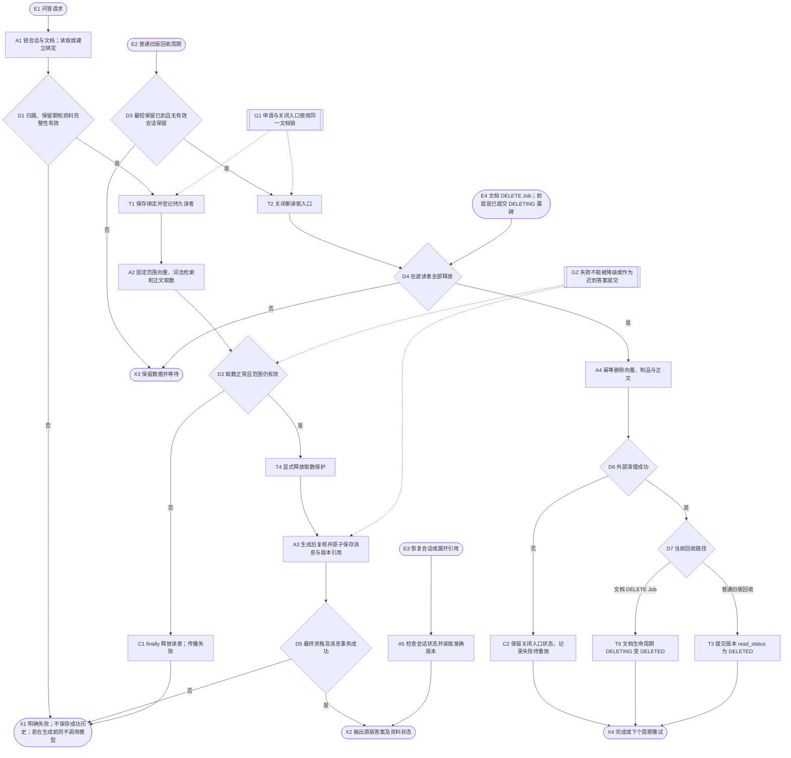
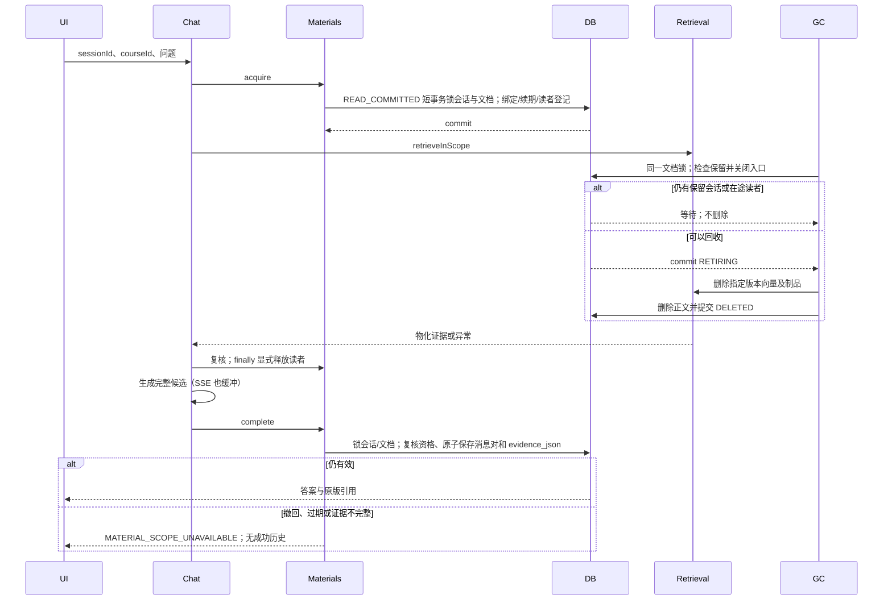
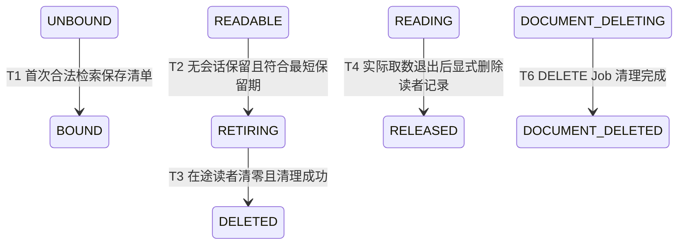

# 会话资料版本保持与安全回收

学习连续性优先。首次问答由服务端在短事务内锁会话及按 ID 排序的文档行，
保存文档到 documentVersionId 的清单；后续问答和补查不再选择最新版。
客户端只能提交 sessionId/courseId，不能上传版本清单。现有项目没有多用户鉴权体系，
此处沿用课程归属检查，不声称新增了用户级访问控制。

会话默认不活跃保留 7 天；合法读取在到期前续期，已到期不可自行续活。版本默认至少保留
7 天。两者均为首版可配置运维默认值，不代表业务已经校准了最优期限。
恢复页面只查询状态，不续期。每轮与恢复时检查更新；一个固定提示区展示状态。
旧会话保留原版本，用户通过“使用当前可用资料开启新对话”切换，旧历史不带入新会话。
旧聊天若没有可证实的版本绑定，则要求新建，不能替旧回答补造版本身份。

## Runtime flow

## Component sequence

## State lifecycle

## Safeguards and failure behavior

- 新清单只选文档指针与 ACTIVE 版本一致的记录；旧清单允许仍可读的 SUPERSEDED，
  但不能把所有 SUPERSEDED 开放给任意请求。空清单同样冻结，后来新增资料只提示更新。
- 激活、撤回、获取读取资格和回收决策均锁同一个 documents 行；锁不跨 Milvus/LLM I/O。
  GC 先提交 RETIRING 再物理删除，已登记读者未释放时只等待。过期会话不能重新注册。
- material_readers 没有租约超时，也不会随删除会话级联删除。进程故障后自动回收会保守阻塞；
  需人工确认对应 process_owner 的进程及后续取数已经终止，才能释放。不得凭记录年龄判断。
- 正文明显缺失、数量与激活期预期不符、串版均使用 EVIDENCE_MISSING；撤回、回收和到期使用
  独立原因枚举。双源收集器不能吞掉 MaterialScopeException。临时单路异常可在原范围降级；
  普通无命中保持无证据语义。
- 模型生成后再次复核。同步和 SSE 成功消息对及 evidence_json 在同一事务提交；SSE 完整
  缓冲，提交前失效、上游失败或取消无答案 delta/成功历史。接受结果的时点是提交事务，
  之后的网络断开不会回滚已保存历史，后续撤回也不追溯抹除历史。
- 引用展示先读会话状态，再以原 documentVersionId 与 chunkId 取数；失效会明确显示原因，
  不打开当前文档的新版本。历史 JSON 保留原始版本元数据。
- 文档撤回经已有 DeleteRequestService 墓碑、撤销摄取 Lease、Job/Outbox，再由 DeleteSaga
  清理。读者未退出时 DELETE Job 延后 30 秒且不消耗失败重试额度。课程删除先为各文档排队，
  返回 409 等待；只有文档物理清理完才允许课程元数据删除。

## Recovery and observability

回收默认每 60 秒处理最多 50 个可回收候选；每个版本每轮一个尝试。Milvus 复用原有 RPC
deadline（默认 30 秒），失败保留 RETIRING，下轮幂等重放。候选查询排除仍保留/有读者版本，
避免前 50 个长期保留对象饿死后续回收。日志记录版本 ID、失败类型与进程 owner/PID/启动时间。
SQL 日志改走 SLF4J，默认 INFO 不输出新增 evidence_json 参数；不要在真实资料环境开启 SQL DEBUG。
配置、崩溃读者的人工恢复步骤、研究来源、实际测试及未执行边界见
[交付说明](../../../backend/docs/session-material-lifecycle.md)。

入口、决策、状态、保障和具名测试映射位于 traceability.yaml。这里是组件级保留与回收协议，
不宣称跨 MySQL/Milvus 事务、分布式租约、模型质量提升或生产环境验收。
